<p align="center">
  
  
  
  
  
  
</p>

<h1 align="center">🧠 RecoverAI</h1>
<h3 align="center">Autonomous AI Revenue Recovery Agent Platform</h3>
<p align="center"><em>A production-grade, self-learning, multi-agent system that autonomously detects failed payments, diagnoses root causes via RAG, orchestrates intelligent recovery through real omni-channel communication (WhatsApp, SMS, Email, Voice), enforces RBI/TRAI compliance with inter-agent debates, and continuously optimizes strategies with reinforcement learning — all on ₹0 infrastructure cost.</em></p>

<p align="center">
  <a href="#-high-level-architecture-hld"></a>
  <a href="#-the-7-autonomous-ai-agents"></a>
  <a href="#-mcp-servers--model-context-protocol"></a>
  <a href="#-rag-knowledge-engine--4-self-evolving-knowledge-bases"></a>
  <a href="#-thompson-sampling-ab-testing-engine"></a>
  <a href="#-quick-start-5-minutes"></a>
</p>

---

## 🎯 Problem Statement

> **"Find revenue that's slipping away and win it back"** — Razorpay Buildathon 2025, Track 03

Indian merchants lose **₹18,000 Cr+ annually** to failed payments, abandoned checkouts, and overdue invoices. Existing recovery solutions are **rule-based**, **single-channel**, and **lack intelligence**. They can't diagnose why a payment failed, can't learn from past recoveries, and can't hold intelligent conversations with customers.

**RecoverAI solves this with a swarm of 7 autonomous AI agents** that think, debate, act, and learn — recovering revenue 24/7 without human intervention. It's not a dashboard — it's an **autonomous recovery brain**.

### 🏆 Why RecoverAI Wins

| Pain Point | Traditional Tools | 🧠 RecoverAI |
|---|---|---|
| **Detection** | Manual monitoring, batch CSV exports | Real-time AI Sentinel with multi-dimensional urgency scoring & failure fingerprinting |
| **Diagnosis** | Generic error codes, no context | RAG-powered root cause analysis with Gemini LLM + bank outage correlation radar |
| **Strategy** | Static if-else rules | Gemini AI strategy inference + Thompson Sampling A/B testing + self-evolving RAG playbook |
| **Compliance** | No guardrails, no legal citations | 8-check guardrail gate with Gemini-powered inter-agent debates & RBI/TRAI legal citations |
| **Execution** | Single channel (usually email) | Omni-channel (WhatsApp + SMS + Email + AI Voice + Auto-Retry) with 3-provider SMS fallback |
| **Learning** | None — same mistakes repeated | Continuous RAG playbook updates + reinforcement learning loop + Bayesian A/B convergence |
| **Languages** | English only | Hindi / Hinglish / English (geo-aware auto-selection based on city) |
| **Two-Way Chat** | ❌ No capability | ✅ Real-time Gemini-powered conversational recovery with NLU intent classification |
| **Cost** | $500+/month SaaS fees | **₹0** — 100% free-tier cloud services |

---

## 🏗️ High-Level Architecture (HLD)

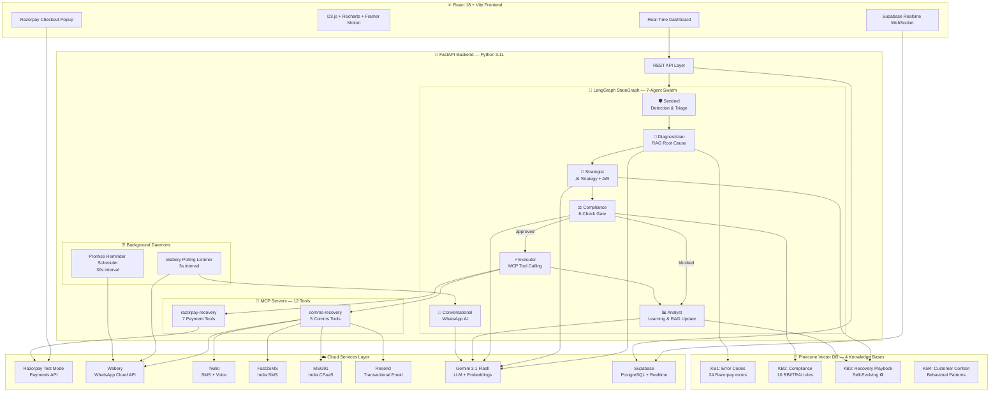

---

## 🔄 Agent Swarm Pipeline — Sequence Diagram

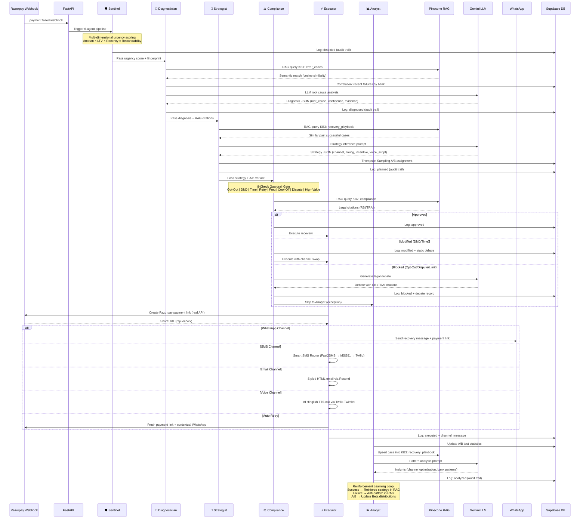

---

## 💬 Two-Way WhatsApp Conversational Recovery — Sequence Diagram

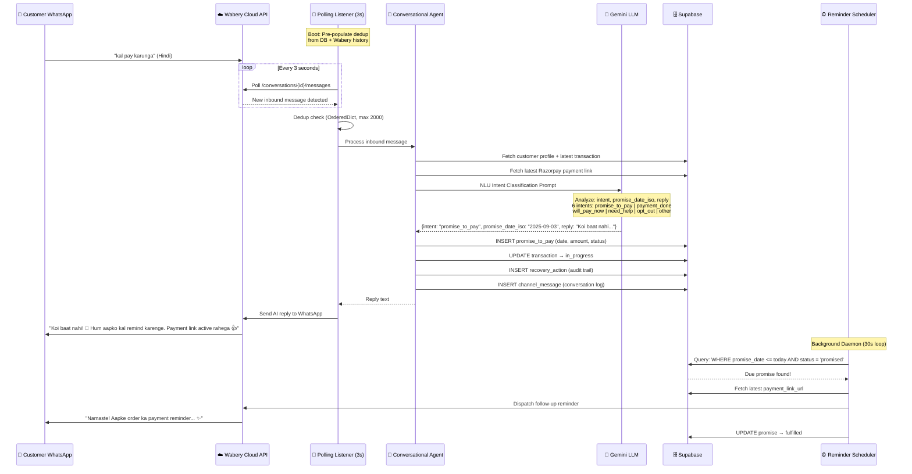

---

## ⚖️ Compliance Gate — Inter-Agent Debate Architecture

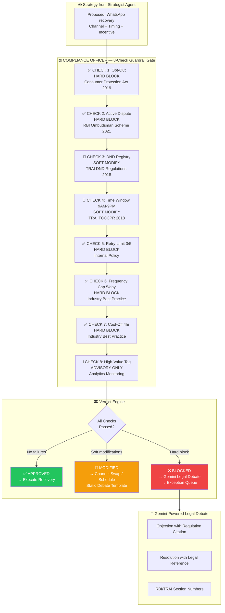

---

## 🧠 RAG Knowledge Engine — 4 Self-Evolving Knowledge Bases

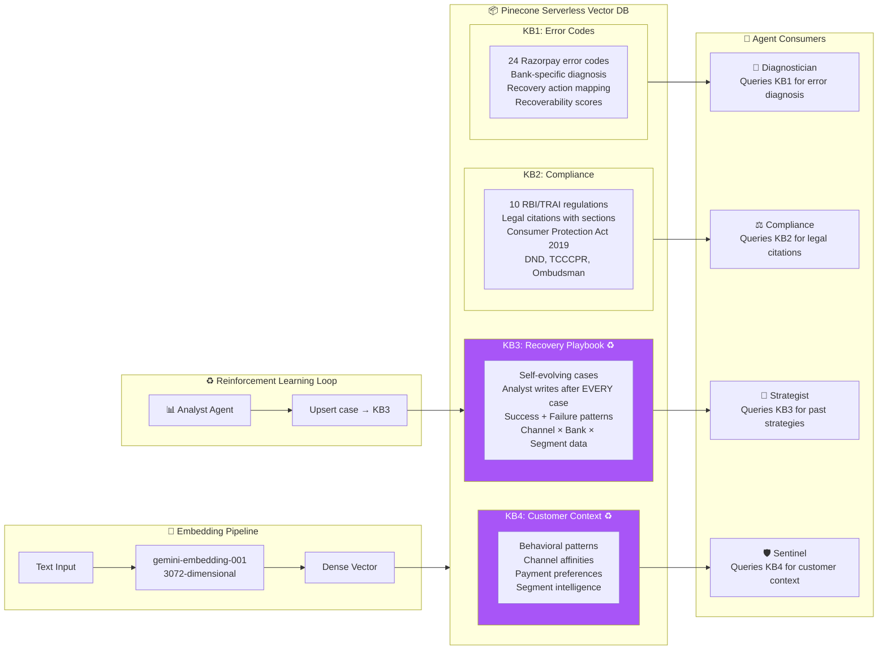

### 🔑 Key RAG Innovation: Self-Evolving Playbook (KB3)

Unlike static rule-based systems, RecoverAI's **KB3: Recovery Playbook** is a **self-evolving knowledge base** that learns from every single recovery attempt:

1. **Analyst Agent** writes every case outcome (**success AND failure**) as a semantically-indexed document into KB3
2. **Strategist Agent** queries KB3 for similar past cases before planning any recovery strategy
3. Over time, the system builds **institutional memory** — what works for which failure type, bank, customer segment, channel, language, and amount range
4. Failed strategies are explicitly stored so the Strategist learns **what NOT to do** — creating negative reinforcement signals
5. This creates a **closed-loop reinforcement learning system** where the platform continuously improves its recovery rate without any human intervention

> **Result**: After processing 200+ transactions through the batch runner, the RAG playbook contains rich contextual intelligence that no rule-based system could match. The Strategist effectively has access to a continuously-growing "institutional brain" of recovery expertise.

---

## 🤖 The 7 Autonomous AI Agents

RecoverAI deploys a **swarm of 7 autonomous AI agents** orchestrated as a **LangGraph StateGraph DAG** (Directed Acyclic Graph). Each agent has a specialized role, its own Gemini LLM instance, access to domain-specific RAG knowledge bases, and logs every action to an immutable audit trail in Supabase.

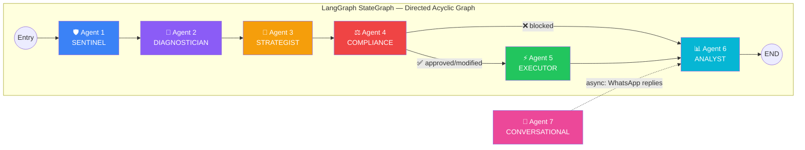

### Agent 1: 🛡️ Sentinel — Detection & Triage

| Aspect | Detail |
|---|---|
| **Role** | First responder — detects failed payments and computes urgency |
| **Intelligence** | Multi-dimensional urgency scoring: `amount × 0.4 + LTV × 0.3 + recency × 0.2 + recoverability × 0.1` |
| **Features** | Failure fingerprinting (MD5 hash of `bank\|error_code\|hour`), deduplication, priority classification (critical/high/medium), customer context loading |
| **Output** | Urgency score, fingerprint, priority level, recoverability estimate |
| **RAG** | Queries KB4 (Customer Context) for behavioral patterns |

### Agent 2: 🔬 Diagnostician — RAG Root Cause Analysis

| Aspect | Detail |
|---|---|
| **Role** | Doctor of failed payments — diagnoses WHY the payment failed |
| **Intelligence** | RAG-powered error code lookup (KB1) + bank outage correlation radar + Gemini LLM diagnosis with confidence scoring |
| **Features** | Correlates failures across banks in 30-min windows to detect outages (≥4 correlated = outage), LLM confidence guardrail (if confidence < 0.7 and disagrees with known reason, uses original), evidence chain generation |
| **Output** | Root cause classification, confidence score, evidence list, outage flag, correlated transactions |
| **RAG** | Queries KB1 (Error Codes) — 24 Razorpay error codes with bank-specific context |
| **LLM** | Gemini 3.1 Flash Lite for root cause inference |

### Agent 3: 🎯 Strategist — AI Recovery Planning

| Aspect | Detail |
|---|---|
| **Role** | Master strategist — plans the optimal recovery approach |
| **Intelligence** | Gemini AI strategy inference + RAG playbook retrieval (KB3) + Thompson Sampling A/B testing + dynamic incentive generation |
| **Features** | 11 strategy decision rules, channel-specific logic (auto_retry for bank_decline, voice for B2B invoice, email for checkout abandonment), AI voice script generation in Hinglish, dynamic discount coupons, payment rail recommendations, customer preference respect, DND-aware channel selection |
| **Output** | Primary + fallback channel, timing, language, tone, incentive, voice script, A/B variant, rail recommendation |
| **RAG** | Queries KB3 (Recovery Playbook) — self-evolving case studies |
| **LLM** | Gemini 3.1 Flash Lite for strategy inference |
| **A/B** | Thompson Sampling with Beta distributions for Bayesian exploration-exploitation |

### Agent 4: ⚖️ Compliance Officer — 8-Check Guardrail Gate

| Aspect | Detail |
|---|---|
| **Role** | Legal guardian — ensures every recovery action complies with Indian regulations |
| **Intelligence** | 8 sequential compliance checks with Gemini-powered inter-agent debates for hard blocks |
| **8 Checks** | 1. Opt-Out (HARD BLOCK) — Consumer Protection Act 2019; 2. Active Dispute (HARD BLOCK) — RBI Ombudsman 2021; 3. DND Registry (SOFT MODIFY) — TRAI DND 2018; 4. Time Window 9AM-9PM (SOFT MODIFY) — TRAI TCCCPR 2018; 5. Retry Limit 3/5 (HARD BLOCK); 6. Frequency Cap 5/day (HARD BLOCK); 7. Cool-Off 4hr (HARD BLOCK); 8. High-Value Advisory (NON-BLOCKING TAG) |
| **Verdicts** | `approved` → execute; `modified` → execute with channel swap (static debate); `blocked` → Gemini generates legal debate with RBI/TRAI citations → exception queue |
| **RAG** | Queries KB2 (Compliance) — 10 RBI/TRAI/Consumer Protection regulations with section numbers |
| **LLM** | Gemini 3.1 Flash Lite for legal debate generation (HARD BLOCKS only — soft modifications use static templates for speed) |

### Agent 5: ⚡ Executor — MCP Tool Execution

| Aspect | Detail |
|---|---|
| **Role** | Action agent — executes the approved recovery strategy via real APIs |
| **Intelligence** | MCP tool-calling across 2 servers (12 tools), probability-based outcome simulation for batch, real API calls for live demo |
| **Features** | Real Razorpay payment link generation (short URL), real WhatsApp via Wabery, SMS via 3-provider smart router (Fast2SMS → MSG91 → Twilio), styled HTML email via Resend, AI voice calls via Twilio Twimlet TTS, auto-retry with contextual messaging (outage/decline/timeout), dynamic incentive injection |
| **MCP Servers** | `razorpay-recovery` (7 tools) + `comms-recovery` (5 tools) |
| **Output** | Channel used, message content, external ID, payment link URL, recovery outcome |

### Agent 6: 📊 Analyst — Learning & Optimization

| Aspect | Detail |
|---|---|
| **Role** | Intelligence officer — learns from every recovery outcome and optimizes future strategies |
| **Intelligence** | Post-recovery RAG playbook updates (KB3), A/B test statistics with significance detection, Gemini-powered pattern analysis |
| **Features** | Writes BOTH success AND failure cases to KB3 (negative reinforcement), updates Beta distributions for Thompson Sampling, detects statistical significance (>30 trials + >10% difference), identifies bank outage patterns, channel optimization insights, segment behavior patterns |
| **Output** | Recovery status, patterns detected, Gemini insights, A/B test updates, playbook contribution |
| **RAG** | **WRITES** to KB3 (Recovery Playbook) — the self-evolving knowledge base |
| **LLM** | Gemini 3.1 Flash Lite for pattern detection and insight generation |
| **Post-Recovery** | Triggered asynchronously on `payment.captured` webhook to learn from WhatsApp recoveries |

### Agent 7: 💬 Conversational Agent — Two-Way WhatsApp AI

| Aspect | Detail |
|---|---|
| **Role** | Customer-facing AI — understands and responds to WhatsApp replies in real-time |
| **Intelligence** | Gemini NLU intent classification (6 intents), promise-to-pay date extraction (Hindi/Hinglish/English), empathetic context-aware reply generation |
| **6 Intents** | `promise_to_pay` — Extract date, create promise, schedule reminder; `payment_done` — Mark recovered, trigger Analyst; `will_pay_now` — Send payment link; `need_help` — Explain failure; `opt_out` — Respect, block comms; `other` — Friendly + link |
| **Features** | Robust date parsing (Hinglish: "kal", "parso", "10 sept", "agla hafta", "Friday", "salary ke baad"), Gemini model fallback chain (5 models), auto-recovery confirmation, promise-to-pay DB tracking |
| **LLM** | Model chain: `gemini-3.1-flash-lite` → `gemini-3.6-flash` → `gemini-3.5-flash-lite` → `gemini-flash-lite-latest` |

---

## 🔧 MCP Servers — Model Context Protocol

RecoverAI implements the **Model Context Protocol (MCP)** — the emerging open standard for AI agent tool-calling. Built with `FastMCP`, two MCP servers expose 12 tools that agents invoke autonomously during recovery execution.

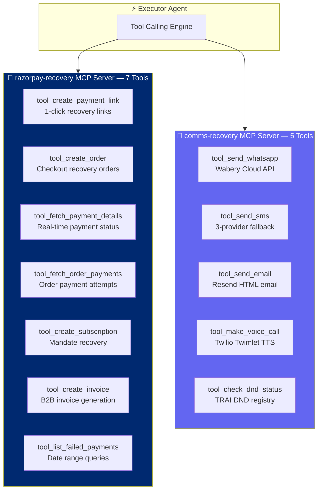

### Razorpay MCP Server (`razorpay-recovery`) — 7 Tools

| # | Tool | Description | API |
|---|---|---|---|
| 1 | `tool_create_payment_link` | Generate 1-click recovery payment links with customer prefill, auto-expiry | Razorpay Payment Links API |
| 2 | `tool_create_order` | Create Razorpay orders for checkout recovery popup integration | Razorpay Orders API |
| 3 | `tool_fetch_payment_details` | Fetch real-time payment status for confirmation loops | Razorpay Payments API |
| 4 | `tool_fetch_order_payments` | List all payment attempts for an order (retry tracking) | Razorpay Orders API |
| 5 | `tool_create_subscription` | Create subscriptions for mandate/auto-debit recovery | Razorpay Subscriptions API |
| 6 | `tool_create_invoice` | Generate B2B invoices for overdue B2B payment recovery | Razorpay Invoices API |
| 7 | `tool_list_failed_payments` | Query failed payments in a date range for batch analysis | Razorpay Payments API |

### Communications MCP Server (`comms-recovery`) — 5 Tools

| # | Tool | Description | Provider |
|---|---|---|---|
| 1 | `tool_send_whatsapp` | Send real WhatsApp messages with payment links (bidirectional) | Wabery (WhatsApp Cloud API) |
| 2 | `tool_send_sms` | Send SMS with auto-fallback chain (Fast2SMS → MSG91 → Twilio) | Multi-provider smart router |
| 3 | `tool_send_email` | Send styled HTML transactional emails with 1-click payment CTA | Resend |
| 4 | `tool_make_voice_call` | AI-powered voice calls with dynamic Hinglish TTS scripts | Twilio (Twimlet TTS) |
| 5 | `tool_check_dnd_status` | Check TRAI DND registry + opt-out status from customer DB | Supabase (Customer DB) |

---

## 🧪 Thompson Sampling A/B Testing Engine

RecoverAI uses **Bayesian Thompson Sampling** — a mathematically optimal multi-armed bandit algorithm that converges **2-5x faster** than traditional frequentist A/B tests by dynamically balancing exploration and exploitation.

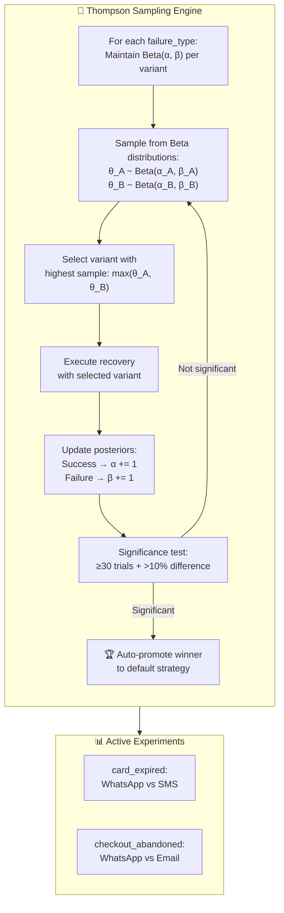

**How it works:**
1. **Initialize**: Each variant starts with `Beta(1, 1)` (uniform prior — no assumptions)
2. **Sample**: Draw a random sample from each variant's Beta distribution
3. **Select**: Choose the variant with the highest sample (natural exploration-exploitation balance)
4. **Execute**: Run the recovery with the selected channel
5. **Update**: After observing outcome, update α (successes) or β (failures)
6. **Converge**: When one variant accumulates enough evidence (≥30 trials + >10% difference), auto-promote the winner

---

## 📡 Omni-Channel Communication Stack

RecoverAI supports **6 real communication channels** with intelligent routing, multi-provider failover, and geo-aware language selection:

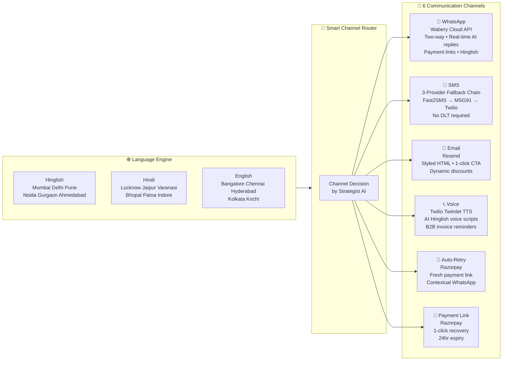

### SMS Smart Routing — 3-Provider Failover Chain

```
1. Fast2SMS (Primary) → Quick SMS route, no DLT, custom text with links
       ↓ (if error)
2. MSG91 (Secondary) → DLT-compliant India CPaaS
       ↓ (if error)
3. Twilio (Tertiary) → Global fallback, template-based for India trial
```

---

## 🗄️ Database Schema — Entity Relationship Diagram

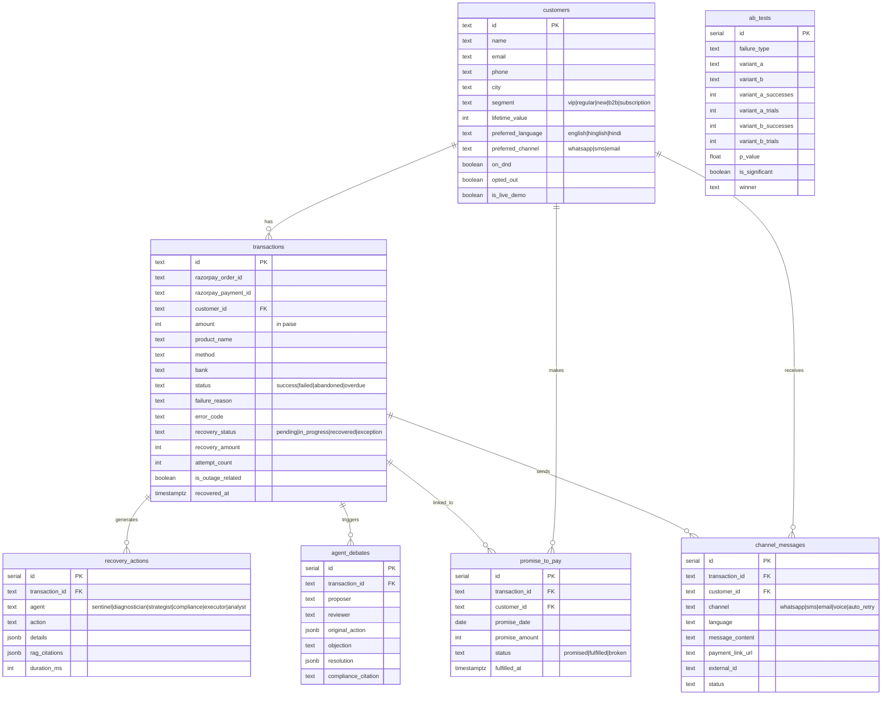

> **7 Tables** | **5 with Supabase Realtime** (WebSocket streaming to frontend) | **7 Optimized Indexes** for agent query performance

---

## 🎬 5 Live Demo Scenarios

Each scenario triggers a **real end-to-end recovery flow** — all 6 agents process in real-time, send actual WhatsApp/SMS/Email/Voice to your phone, and generate real Razorpay payment links.

| # | Scenario | Failure Type | Agent Pipeline | Real Channel Output |
|---|---|---|---|---|
| 1 | 💳 **Card Expired** | `card_expired` | Full 6-agent → WhatsApp with Razorpay payment link | Real WhatsApp message arrives on your phone |
| 2 | 📄 **B2B Invoice Overdue** | `invoice_overdue` | 6-agent → AI Voice Call (Hinglish TTS) + Email | Real phone call + styled HTML email arrives |
| 3 | 🛒 **Checkout Abandoned** | `checkout_abandoned` | 6-agent → Email (1-click CTA + discount coupon) + WhatsApp follow-up | Real email with dynamic 10% discount |
| 4 | ❌ **Opted-Out Customer** | `card_expired` + `opted_out=true` | 6-agent → Compliance BLOCKS ALL → Gemini legal debate | Agent debate with Consumer Protection Act citation |
| 5 | 🏦 **Bank Decline / Outage** | `bank_decline` | 6-agent → Auto-retry + outage radar correlation | Real WhatsApp with fresh retry link |

### Razorpay Checkout Integration

RecoverAI features **native Razorpay Checkout integration** — the frontend opens a **real Razorpay payment popup**. When payment fails (intentionally in test mode), the `payment.failed` webhook automatically triggers the 6-agent swarm pipeline. When payment succeeds, `payment.captured` triggers the Analyst agent's post-recovery learning.

---

## 📊 Real-Time Dashboard

A full-featured **React 18 dashboard** with **15 components**, live updates via **Supabase Realtime WebSocket**, and rich data visualizations:

| Component | Description | Technology |
|---|---|---|
| **Metric Cards** | At-risk, processing, recovered, exceptions — animated live counters | Framer Motion |
| **Live Agent Feed** | Real-time scrolling feed of agent actions with duration badges and intent tags | Supabase Realtime |
| **Swarm Topology** | Animated network graph showing agent interconnections and message flow | D3.js force layout |
| **Recovery Funnel** | Sankey visualization: At Risk → Detected → Recovered / Exception | D3-Sankey |
| **Pattern Radar** | Bank outage detection, failure clusters, payment rail analysis, high-value alerts | Recharts |
| **Pattern Deep Dive** | Multi-dimensional failure analytics with bank health, root cause breakdown, rail performance | D3.js + Recharts |
| **Live Demo Buttons** | One-click scenario triggers with native Razorpay Checkout popup | Razorpay SDK |
| **Promise Tracker** | Real-time promise-to-pay monitoring with status badges and countdown timers | Supabase Realtime |
| **A/B Test Results** | Live experiment tracking with Thompson Sampling variant performance | Recharts |
| **Language Stats** | Recovery performance by Hindi/Hinglish/English with geo-distribution | Recharts |
| **Agent Debate View** | Full transparency into Strategist ↔ Compliance debates with legal citations | Custom UI |
| **Exception Report** | Blocked transactions with compliance reasons and debate records | Supabase query |
| **Transaction Deep Dive** | Per-transaction 6-agent timeline with all outputs, durations, and RAG citations | Custom timeline |
| **War Room** | Emergency command center for bank outage management and correlation | D3.js |
| **PDF Audit Report** | Downloadable compliance audit report (WeasyPrint HTML → PDF) | WeasyPrint + Jinja2 |

---

## 🛠️ Tech Stack

| Layer | Technology | Purpose |
|---|---|---|
| **Backend** | Python 3.11 + FastAPI | High-performance async REST API with lifespan management |
| **Agent Orchestration** | LangGraph StateGraph | Directed Acyclic Graph (DAG) for multi-agent workflow orchestration |
| **LLM** | Google Gemini 3.1 Flash Lite | Sub-3s latency inference for real-time agent decisions |
| **Embeddings** | gemini-embedding-001 | 3072-dimensional dense vectors for semantic RAG search |
| **Tool Protocol** | MCP (Model Context Protocol) + FastMCP | Standardized AI agent tool-calling interface — 12 tools across 2 servers |
| **Vector Database** | Pinecone Serverless (AWS us-east-1) | 4-namespace RAG knowledge engine with cosine similarity |
| **Database** | Supabase (Cloud PostgreSQL) | 7-table schema with Realtime WebSocket pub/sub on 5 tables |
| **Payments** | Razorpay SDK (Test Mode) | Payment links, orders, checkout, subscriptions, invoices, webhooks |
| **WhatsApp** | Wabery (WhatsApp Cloud API) | Live two-way bidirectional WhatsApp messaging with AI replies |
| **SMS** | Fast2SMS + MSG91 + Twilio | 3-provider smart fallback chain for India SMS delivery |
| **Email** | Resend | Transactional email with styled HTML templates and 1-click CTA |
| **Voice** | Twilio (Twimlet TTS) | Dynamic AI Hinglish voice call reminders for B2B recovery |
| **Frontend** | React 18 + Vite | Single-page application with hot module replacement |
| **Visualization** | D3.js + D3-Sankey + Recharts + Framer Motion | Interactive charts, Sankey diagrams, force-directed graphs, animations |
| **Realtime** | Supabase Realtime (WebSocket) | Live dashboard updates without polling — server push |
| **PDF** | WeasyPrint + Jinja2 | Compliance audit report generation (HTML → PDF) |
| **State** | React Hooks + Axios | Lightweight data fetching with custom hooks |

---

## 🚀 Quick Start (5 Minutes)

### Prerequisites

- Python 3.11+
- Node.js 18+
- Free accounts on: [Supabase](https://supabase.com), [Pinecone](https://app.pinecone.io), [Razorpay](https://dashboard.razorpay.com) (test mode), [Twilio](https://www.twilio.com), [Wabery](https://wabery.com), [Resend](https://resend.com), [Fast2SMS](https://www.fast2sms.com), [MSG91](https://msg91.com), [Google AI Studio](https://aistudio.google.com/apikey)

### 1. Clone & Setup

```bash
git clone https://github.com/Gagan202005/recover-ai.git
cd recover-ai
cp .env.example .env
# Fill in your API keys in .env (all free tier)
```

### 2. Install Dependencies

```bash
# Backend
cd backend && pip install -r requirements.txt

# Frontend
cd ../frontend && npm install
```

### 3. Database Setup

1. Create a Supabase project at [supabase.com](https://supabase.com)
2. Go to SQL Editor → Run `backend/schema.sql`
3. This creates **7 tables** with Realtime enabled on 5 + 7 optimized indexes

### 4. Ingest RAG Documents (One-Time)

```bash
cd backend && python -m rag.ingest
```

Creates the Pinecone index and ingests **24 error codes + 10 compliance rules** into KB1 + KB2.

### 5. Run Batch Processing (One-Time, Pre-Demo)

```bash
cd backend && python -m simulation.batch_runner
```

Generates **50 customers + 200 transactions**, processes them through the **6-agent swarm**, trains the **self-evolving RAG playbook** (KB3), and populates the dashboard with rich analytics data.

### 6. Start Development Servers

```bash
# Terminal 1 — Backend (+ background services auto-start)
cd backend && uvicorn main:app --reload --host 0.0.0.0 --port 8000

# Terminal 2 — Frontend
cd frontend && npm run dev
```

On backend startup, two background daemons launch automatically:
- ✅ **Wabery WhatsApp Polling Listener** (3s interval) — two-way messaging
- ✅ **Promise-to-Pay Reminder Scheduler** (30s interval) — auto follow-ups

### 7. (Optional) Webhook Tunnel for Razorpay

```bash
ngrok http 8000
```

Set the ngrok URL in Razorpay Dashboard → Webhooks:
- `https://your-ngrok.ngrok.io/api/webhooks/razorpay` → Events: `payment.captured`, `payment.failed`

### Makefile Shortcuts

```bash
make setup        # First-time setup (copy .env, install deps)
make install      # Install dependencies only
make ingest-rag   # Ingest RAG documents into Pinecone
make seed         # Run batch processing (50 customers + 200 txns)
make dev-backend  # Start FastAPI server
make dev-frontend # Start Vite dev server
make tunnel       # Start ngrok tunnel
```

---

## 📁 Project Structure

```
recover-ai/
├── backend/
│   ├── agents/                          # 🤖 7 AI Agent Modules
│   │   ├── sentinel.py                  # Agent 1: Detection & Triage (urgency scoring)
│   │   ├── diagnostician.py             # Agent 2: RAG Root Cause Analysis (KB1 + Gemini)
│   │   ├── strategist.py                # Agent 3: Gemini AI Strategy + A/B Testing (KB3)
│   │   ├── compliance.py                # Agent 4: 8-Check Guardrail Gate + Debates (KB2)
│   │   ├── executor.py                  # Agent 5: MCP Tool Execution (12 tools)
│   │   ├── analyst.py                   # Agent 6: Learning & Optimization (writes KB3)
│   │   ├── conversational_agent.py      # Agent 7: Two-Way WhatsApp AI (NLU + Gemini)
│   │   ├── swarm.py                     # LangGraph StateGraph Orchestrator (DAG)
│   │   └── state.py                     # Shared Agent State Schema (TypedDict)
│   │
│   ├── mcp_servers/                     # 🔧 Model Context Protocol Servers
│   │   ├── razorpay_server.py           # 7 Razorpay payment tools (FastMCP)
│   │   └── comms_server.py              # 5 communication tools (FastMCP)
│   │
│   ├── rag/                             # 🧠 RAG Knowledge Engine
│   │   ├── pinecone_client.py           # 4-namespace vector search (cosine similarity)
│   │   ├── embeddings.py                # gemini-embedding-001 wrapper (3072-dim)
│   │   ├── ingest.py                    # Document ingestion pipeline (one-time)
│   │   └── data/                        # Knowledge base source files
│   │       ├── error_codes.json         # 24 Razorpay error codes (KB1)
│   │       └── compliance_rules.json    # 10 RBI/TRAI regulations (KB2)
│   │
│   ├── channels/                        # 📡 Multi-Channel Communication
│   │   ├── razorpay_client.py           # Razorpay SDK wrapper (payment links, orders)
│   │   ├── wabery_client.py             # WhatsApp Cloud API (Wabery) — outbound
│   │   ├── wabery_listener.py           # Two-Way WhatsApp Polling Listener (inbound)
│   │   ├── twilio_client.py             # SMS + Voice (Twilio + Twimlet TTS)
│   │   ├── fast2sms_client.py           # Quick SMS for India (no DLT required)
│   │   ├── msg91_client.py              # India SMS + WhatsApp CPaaS
│   │   ├── email_client.py              # Transactional email (Resend)
│   │   ├── sms_router.py               # Smart SMS 3-provider fallback chain
│   │   └── message_templates.py         # Multi-language templates (Hindi/Hinglish/English)
│   │
│   ├── api/                             # 🌐 FastAPI REST Endpoints
│   │   ├── dashboard.py                 # Dashboard metrics, agent feed, analytics
│   │   ├── transactions.py              # Transaction CRUD, deep dive, search
│   │   ├── simulation.py                # Live demo triggers, Razorpay Checkout
│   │   ├── webhooks.py                  # Razorpay + Twilio + Wabery webhooks
│   │   └── reports.py                   # PDF audit report generation
│   │
│   ├── simulation/                      # 🎮 Demo & Simulation
│   │   ├── batch_runner.py              # Batch: 50 customers + 200 txns through swarm
│   │   ├── data_generator.py            # Realistic customer + transaction generation
│   │   ├── live_scenarios.py            # 5 live demo scenario definitions
│   │   └── reminder_scheduler.py        # Promise-to-pay reminder daemon (30s loop)
│   │
│   ├── reports/                         # 📄 PDF Report Generation
│   │   ├── pdf_generator.py             # WeasyPrint HTML → PDF engine
│   │   └── templates/                   # Jinja2 report templates
│   │
│   ├── main.py                          # FastAPI app entry point + lifespan
│   ├── config.py                        # Pydantic settings (all env vars)
│   ├── database.py                      # Supabase client + helper functions
│   ├── schema.sql                       # PostgreSQL schema (7 tables, 7 indexes)
│   ├── requirements.txt                 # Python dependencies
│   └── test_backend.py                  # Test suite
│
├── frontend/
│   ├── src/
│   │   ├── components/                  # 🎨 15 React Components
│   │   │   ├── MetricCards.jsx          # At-risk, processing, recovered metrics
│   │   │   ├── LiveAgentFeed.jsx        # Real-time agent action stream
│   │   │   ├── SwarmTopology.jsx        # D3.js agent network graph
│   │   │   ├── LiveDemoButtons.jsx      # 5 scenario triggers + Razorpay Checkout
│   │   │   ├── PatternCards.jsx         # Bank outage radar + failure clusters
│   │   │   ├── PatternDeepDive.jsx      # Multi-dimensional analytics
│   │   │   ├── PromiseTracker.jsx       # Promise-to-pay monitoring
│   │   │   ├── ABTestResults.jsx        # Thompson Sampling experiment UI
│   │   │   ├── LanguageStats.jsx        # Hindi/Hinglish/English breakdown
│   │   │   ├── AgentDebateView.jsx      # Compliance debate viewer
│   │   │   ├── ExceptionReport.jsx      # Blocked transaction report
│   │   │   ├── TransactionDeepDive.jsx  # Per-txn agent timeline
│   │   │   ├── WarRoom.jsx             # Bank outage command center
│   │   │   ├── CoverPage.jsx           # Branded landing/demo page
│   │   │   └── Confetti.jsx            # Recovery celebration animation
│   │   ├── hooks/                       # Custom React hooks
│   │   ├── utils/                       # API helpers + Supabase client
│   │   ├── App.jsx                      # Main application router
│   │   ├── App.css                      # App-level styles
│   │   └── index.css                    # Design system (86KB)
│   ├── index.html                       # SPA entry point
│   ├── vite.config.js                   # Vite + React plugin config
│   └── package.json                     # Frontend dependencies
│
├── .env.example                         # Comprehensive env template
├── Makefile                             # Developer shortcuts
└── README.md                            # This file
```

---

## 🔑 Key Innovations & Differentiators

### 1. 🧠 Self-Evolving RAG Playbook (KB3)
Unlike every other recovery tool that uses static rules, RecoverAI **learns from every single recovery attempt**. The Analyst agent writes both successful and failed cases into the vector database, creating a continuously-improving institutional knowledge base. The Strategist queries this before planning any recovery.

### 2. ⚖️ Inter-Agent Debates with Legal Citations
When the Compliance Officer blocks a recovery action, it doesn't just say "blocked" — it uses **Gemini to generate a full legal debate** with specific RBI/TRAI regulation citations, section numbers, and resolution recommendations. This creates unprecedented transparency and auditability.

### 3. 💬 Conversational Revenue Recovery
RecoverAI doesn't just blast messages — it **understands customer replies** in real-time. A customer can reply "kal pay karunga" (Hindi for "I'll pay tomorrow") and the system will: extract the date, create a promise-to-pay record, schedule an automatic reminder, and send an empathetic acknowledgment — all powered by Gemini NLU.

### 4. 🧪 Bayesian A/B Testing
Instead of traditional A/B tests that waste traffic on 50/50 splits, RecoverAI uses **Thompson Sampling** with Beta distributions — a mathematically optimal approach that automatically allocates more traffic to the winning variant while still exploring alternatives.

### 5. 📡 3-Provider SMS Fallover
SMS delivery in India is notoriously unreliable. RecoverAI implements a **3-provider cascade**: Fast2SMS (quick, no DLT) → MSG91 (DLT-compliant) → Twilio (global fallback). This ensures maximum deliverability.

### 6. 🔧 MCP Tool Protocol
RecoverAI is one of the **first production applications** to implement the **Model Context Protocol (MCP)** — the emerging standard for AI agent tool-calling. This makes the system modular, extensible, and future-proof.

### 7. 🏦 Bank Outage Correlation Radar
The Diagnostician agent doesn't just look at individual failures — it correlates failures across all transactions from the same bank within a 30-minute window. If ≥4 correlated failures are detected, it flags a **bank outage**, switches strategy to auto-retry with delay, and alerts the War Room.

### 8. 🎙️ AI Voice Calls in Hinglish
For B2B invoice recovery, the system generates **dynamic Hinglish voice scripts** customized with the customer's name, amount, and product — then makes a real phone call using Twilio's Twimlet TTS engine. This is particularly effective for Indian B2B collections.

---

## 📐 System Design Decisions

| Decision | Rationale |
|---|---|
| **LangGraph StateGraph over LangChain Agents** | StateGraph gives us explicit DAG control over agent ordering, conditional branching (compliance gate), and shared state — critical for deterministic recovery pipelines |
| **Gemini Flash Lite over GPT-4** | Sub-3s latency requirement for real-time recovery. Flash Lite provides the speed-quality balance needed for production agent systems |
| **Pinecone Serverless over Chroma/FAISS** | Cloud-native, zero-ops, free tier, supports namespaced multi-tenant KB architecture |
| **Supabase over Firebase** | Real PostgreSQL with SQL queries, Row-Level Security, built-in Realtime WebSocket — perfect for agent audit trails |
| **MCP over direct function calls** | Standardized tool interface allows agents to be swapped, tools to be added independently, and aligns with the MCP standard |
| **Wabery over Twilio WhatsApp** | True 2-way custom messaging (not template-only), sandbox available, simpler API for real-time polling |
| **Thompson Sampling over A/B** | 2-5x faster convergence, no wasted traffic on losing variants, mathematically optimal exploration-exploitation |
| **WeasyPrint over Puppeteer** | Pure Python, no headless Chrome dependency, lighter deployment footprint |
| **Pydantic Settings over dotenv** | Type-safe configuration with validation, autocomplete support, multiple `.env` file support |

---

## 🏗️ Background Services Architecture

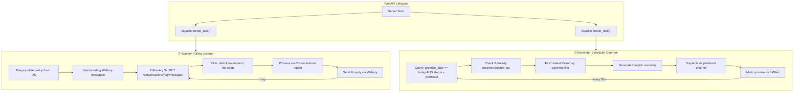

---

## 📊 API Endpoints

| Method | Endpoint | Description |
|---|---|---|
| `GET` | `/` | Service info (agents, tools, features) |
| `GET` | `/api/health` | Health check with background service status |
| `GET` | `/api/mcp/servers` | List MCP servers and their 12 tools |
| `GET` | `/api/dashboard/metrics` | At-risk, processing, recovered, exceptions |
| `GET` | `/api/dashboard/agent-feed` | Real-time agent action stream |
| `GET` | `/api/dashboard/patterns` | Bank outage radar, failure clusters |
| `GET` | `/api/dashboard/ab-tests` | A/B test experiment results |
| `GET` | `/api/dashboard/language-stats` | Recovery by language breakdown |
| `GET` | `/api/transactions` | All transactions with filters |
| `GET` | `/api/transactions/:id` | Transaction deep dive with agent timeline |
| `GET` | `/api/transactions/:id/debates` | Agent debates for a transaction |
| `POST` | `/api/simulation/trigger/:scenario` | Trigger live demo scenario |
| `POST` | `/api/simulation/create-checkout-order/:scenario` | Create Razorpay order for Checkout popup |
| `POST` | `/api/webhooks/razorpay` | Razorpay payment.captured / payment.failed |
| `POST` | `/api/webhooks/twilio/whatsapp` | Twilio WhatsApp incoming messages |
| `POST` | `/api/webhooks/wabery` | Wabery WhatsApp incoming messages |
| `GET` | `/api/reports/pdf` | Download compliance audit report (PDF) |
| `GET` | `/api/dashboard/promises` | Active promise-to-pay records |
| `POST` | `/api/dashboard/dispatch-reminders` | Manually dispatch due reminders |

---

## 🔒 Security & Compliance

- **No auto-debit**: RecoverAI only sends payment links — the customer always authorizes payment themselves
- **RBI/TRAI compliance**: 8-check guardrail gate with legal citations from Consumer Protection Act 2019, TRAI DND 2018, TRAI TCCCPR 2018, RBI Ombudsman Scheme 2021
- **Opt-out respect**: Immediate hard block on customer opt-out across all channels
- **DND enforcement**: Automatic channel swap (SMS/Voice → WhatsApp/Email) for DND-registered numbers
- **Time window**: No communications outside 9 AM - 9 PM IST
- **Rate limiting**: Max 5 messages/customer/day, 4-hour cool-off between contacts
- **Audit trail**: Every agent action logged to `recovery_actions` table with timestamps and RAG citations
- **Webhook verification**: Razorpay webhook signature verification
- **Message deduplication**: Shared OrderedDict (max 2000 entries) prevents duplicate WhatsApp replies across polling + webhook paths

---

## 📈 Performance Metrics

| Metric | Value |
|---|---|
| **Agent Pipeline Latency** | ~3-8s end-to-end (6 agents, 3-4 LLM calls) |
| **LLM Inference** | <3s per Gemini Flash Lite call |
| **RAG Query** | <500ms per Pinecone vector search |
| **WhatsApp Delivery** | <2s via Wabery Cloud API |
| **Polling Interval** | 3s for WhatsApp inbound message detection |
| **Reminder Check** | Every 30s for due promise-to-pay |
| **Dedup Cache** | 2000 entries (OrderedDict, O(1) lookup) |
| **Dashboard Refresh** | Real-time via Supabase WebSocket (no polling) |
| **Batch Throughput** | 200 transactions in ~15 minutes (with RAG + LLM) |
| **Infrastructure Cost** | **₹0** (all free-tier cloud services) |

---

## 🤝 Team

| Name | Role |
|---|---|
| **Gagan Singhal** | Full-Stack AI Engineer — Architecture, Agents, MCP, RAG, Frontend, Infrastructure |

---

## 📜 License

This project was built for the **Razorpay Buildathon 2025** — Track 03: AI Revenue Recovery.

---

<p align="center">
  <strong>Built with 🧠 by RecoverAI — Where AI meets revenue recovery</strong>
</p>
<p align="center">
  <em>7 Agents • 12 MCP Tools • 4 RAG Knowledge Bases • 6 Communication Channels • ₹0 Cost</em>
</p>
