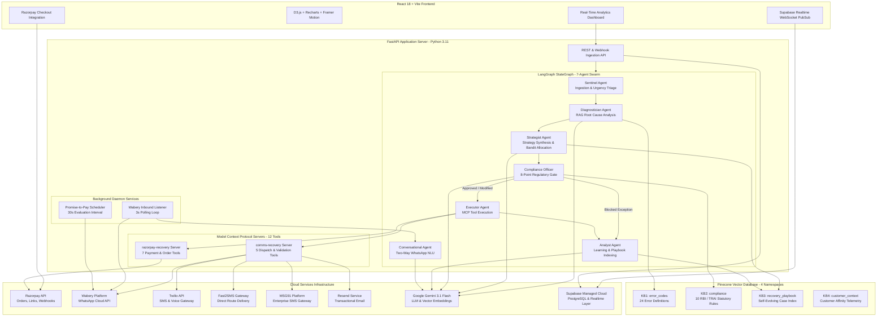
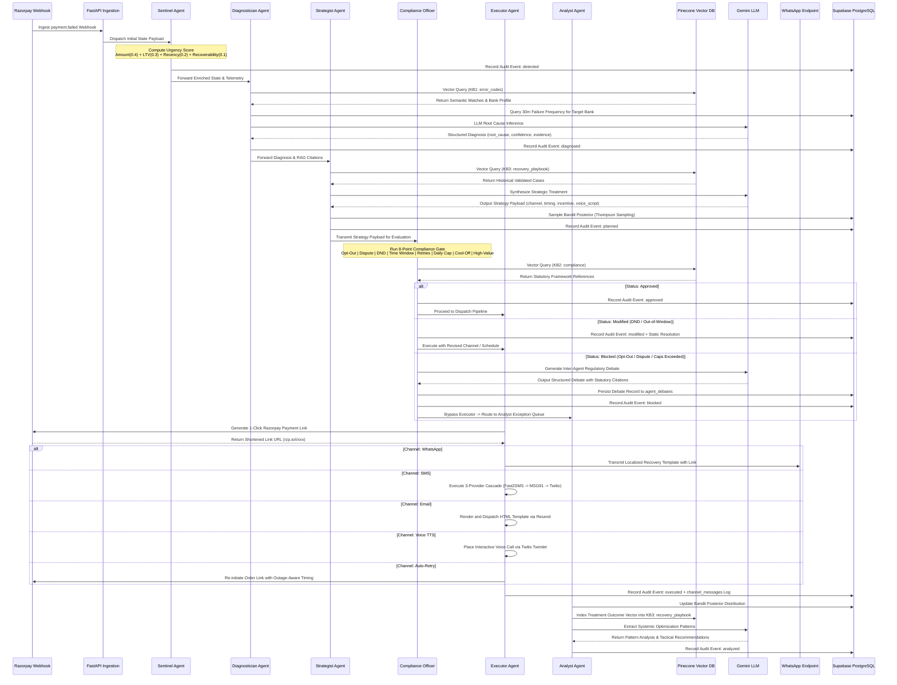
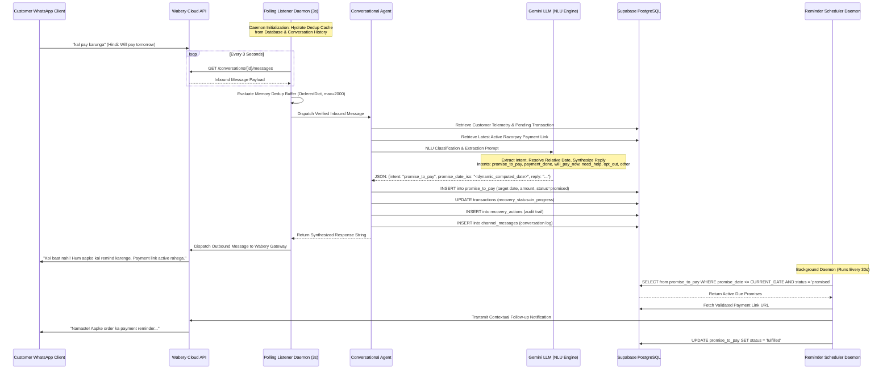
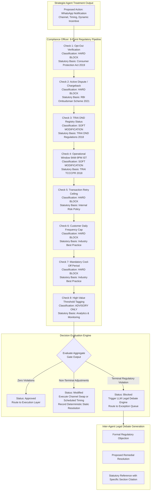
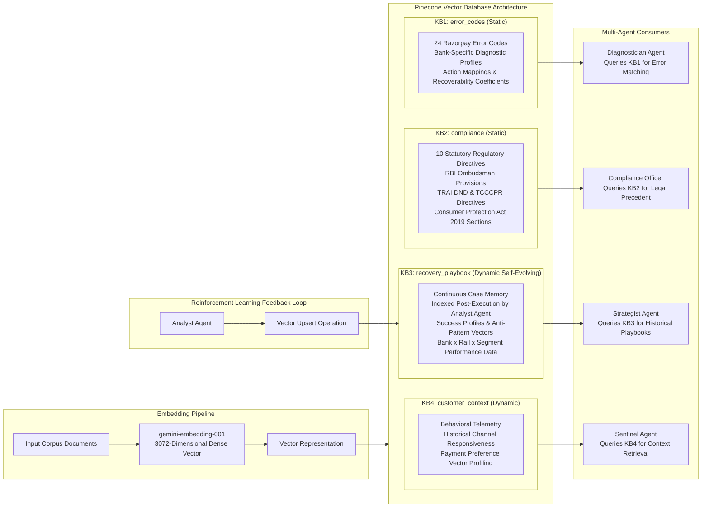
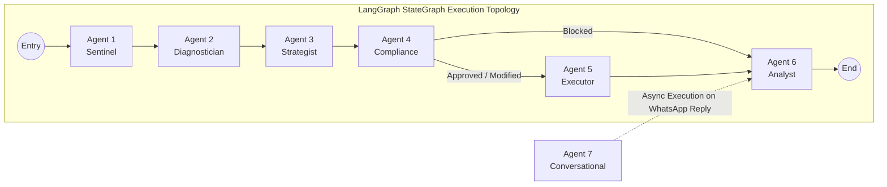
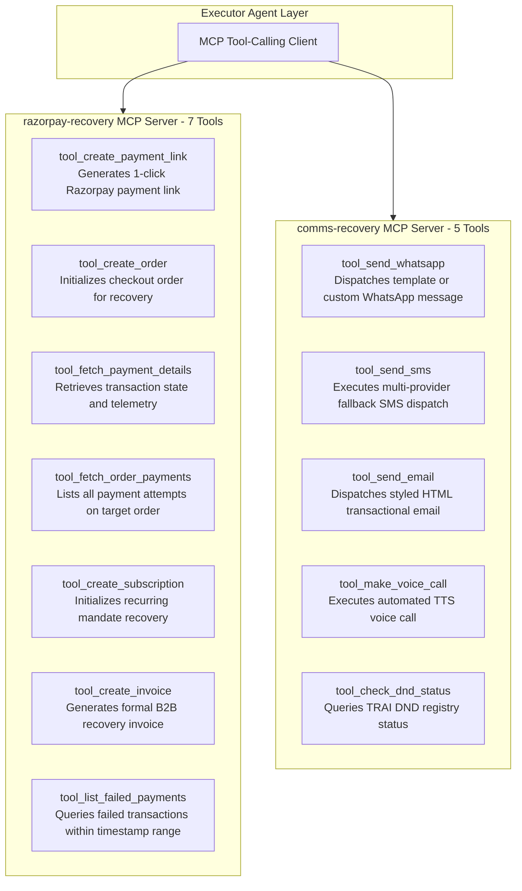
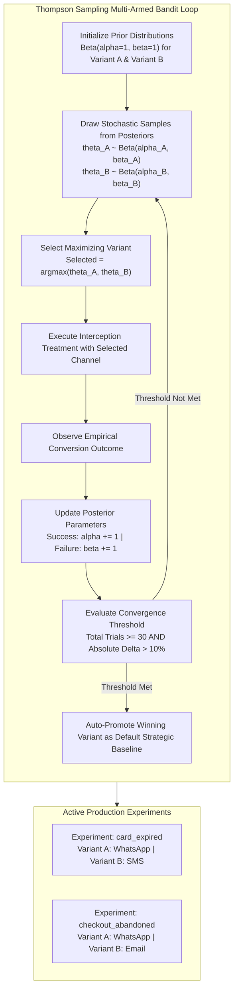
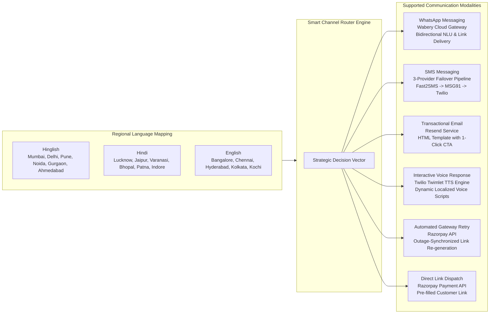
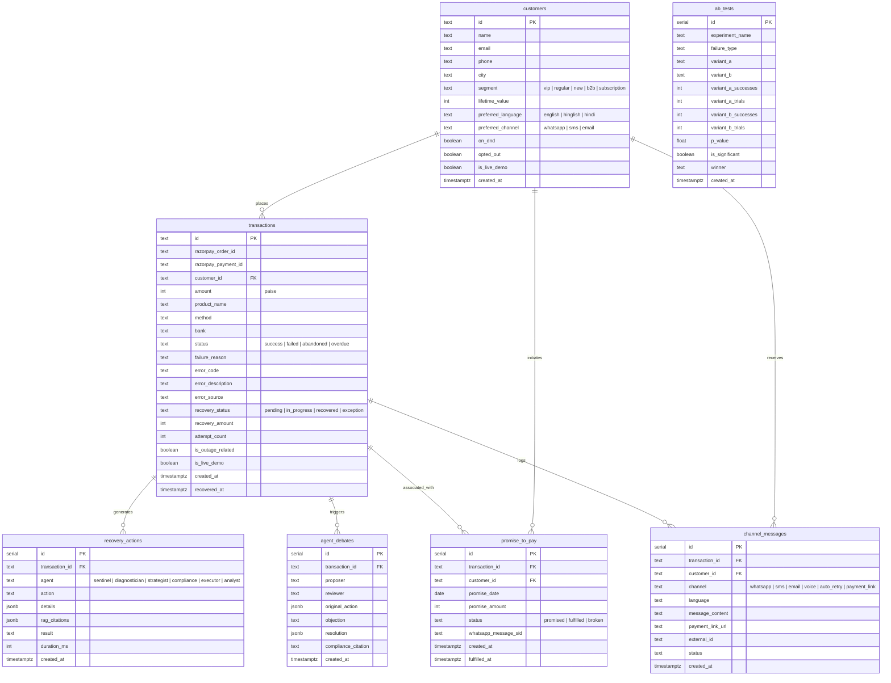

<p align="center">
  
  
  
  
  
  
</p>

<h1 align="center">RecoverAI</h1>
<h3 align="center">Autonomous Revenue Recovery Multi-Agent Platform</h3>
<p align="center"><em>A production-grade, self-learning multi-agent platform that autonomously intercepts failed transactions, diagnoses root causes via vector retrieval (RAG), orchestrates recovery across omni-channel communication pathways (WhatsApp, SMS, Email, Voice), enforces RBI and TRAI regulatory compliance with inter-agent debate protocols, and continuously optimizes conversion heuristics via reinforcement learning.</em></p>

<p align="center">
  <a href="#high-level-architecture-hld"></a>
  <a href="#the-7-autonomous-ai-agents"></a>
  <a href="#mcp-servers--model-context-protocol"></a>
  <a href="#rag-knowledge-engine--4-knowledge-bases"></a>
  <a href="#thompson-sampling-ab-testing-engine"></a>
  <a href="#quick-start-5-minutes"></a>
</p>

---

## Problem Statement

> **"Find revenue that's slipping away and win it back"** — Razorpay Buildathon 2026, Track 03

Indian digital commerce businesses experience an estimated **₹18,000+ Crore in annual gross merchandise value (GMV) leakage** due to payment gateway drop-offs, card issuer declines, customer abandonment, and unresolved B2B invoices. Conventional recovery tools operate on rigid, single-channel heuristics with no contextual awareness, static retry logic, and zero adaptive learning.

**RecoverAI addresses this through an autonomous swarm of 7 specialized AI agents** orchestrated over a LangGraph StateGraph DAG. The platform diagnoses transaction failures, executes policy-governed interventions, conducts bidirectional conversational negotiations, and writes validated recovery strategies into vector memory for continuous policy refinement.

### Solution Comparison

| Functional Area | Traditional Recovery Systems | RecoverAI Platform |
|---|---|---|
| **Interception & Triage** | Periodic batch CSV exports, manual review | Real-time event ingestion with multi-dimensional urgency scoring and fingerprint deduplication |
| **Root Cause Diagnosis** | Opaque error codes, no contextual telemetry | RAG-augmented error classification with Gemini LLM and 30-minute rolling bank outage correlation radar |
| **Strategy Formulation** | Hardcoded conditional branches | Dynamic Gemini strategy inference, Thompson Sampling multi-armed bandit allocation, and vector playbook recall |
| **Regulatory Guardrails** | Absent or hardcoded blacklist checks | 8-point compliance validation pipeline with LLM-backed regulatory debates citing RBI and TRAI statutory provisions |
| **Execution Layer** | Single-channel blasts (typically email) | Dynamic omni-channel orchestration (WhatsApp, SMS, Email, Voice TTS, Auto-Retry) with 3-provider SMS failover |
| **Policy Learning** | Static rules requiring manual updates | Autonomous closed-loop reinforcement: case indexing into vector database (successes and anti-patterns) |
| **Linguistic Localization** | English-only templates | Dynamic localization across Hindi, Hinglish, and English driven by regional geolocation heuristics |
| **Conversational Recovery** | Unsupported | Bidirectional WhatsApp interaction with natural language understanding (NLU) and automated promise tracking |
| **Infrastructure Overhead** | High enterprise subscription cost | Zero operational cost using managed free-tier cloud primitives |

---

## High-Level Architecture (HLD)



---

## Agent Swarm Pipeline - Sequence Diagram



---

## Two-Way WhatsApp Conversational Recovery Flow



---

## Compliance Gate - Inter-Agent Debate Architecture



---

## RAG Knowledge Engine - 4 Knowledge Bases



### Self-Evolving Playbook (KB3) Mechanics

Unlike legacy static rules engines, RecoverAI's **KB3: recovery_playbook** namespace operates as an evolving memory graph:

1. Following each recovery attempt, the **Analyst Agent** indexes the transaction profile, contextual failure reason, applied treatment, and observed conversion result into KB3.
2. The vector index retains both **successful recoveries** and **unsuccessful attempts**, encoding positive reinforcement and negative anti-patterns.
3. When the **Strategist Agent** evaluates an incoming failure, it executes an approximate nearest neighbor (ANN) cosine similarity search against KB3 using contextual metadata filters.
4. Over continuous operation, the system derives empirical conversion probabilities across combinations of failure mode, issuing bank, transaction amount tier, and communication channel.

---

## The 7 Autonomous AI Agents

RecoverAI deploys a multi-agent topology organized as an explicit LangGraph StateGraph DAG. Each agent operates with discrete responsibilities, dedicated system prompts, and vector database query access.



### Agent 1: Sentinel - Ingestion & Urgency Triage

| Specification | Implementation Details |
|---|---|
| **Primary Function** | Event ingestion, urgency computation, failure fingerprint generation, deduplication |
| **Scoring Formula** | `Urgency = (Amount_Norm * 0.4) + (LTV_Norm * 0.3) + (Recency_Norm * 0.2) + (Recoverability * 0.1)` |
| **Deduplication** | MD5 hash computed over `bank | error_code | YYYYMMDDHH` string tokens |
| **Output Payload** | Urgency index (0.0 to 1.0), Priority tier (Critical, High, Medium), Normalized Recoverability estimate |
| **Vector Retrieval** | Evaluates KB4 (`customer_context`) for customer lifetime value and affinity telemetry |

### Agent 2: Diagnostician - RAG Root Cause Analysis

| Specification | Implementation Details |
|---|---|
| **Primary Function** | Root cause determination combining vector search, outage telemetry, and LLM reasoning |
| **Outage Correlation** | Queries rolling 30-minute window for identical bank failures; thresholds >= 4 correlated failures as an active outage |
| **Confidence Safeguard** | If LLM diagnosis diverges from transaction error code and confidence is < 0.70, falls back to deterministic telemetry |
| **Output Payload** | Canonical root cause, confidence score, evidence array, bank outage boolean flag |
| **Vector Retrieval** | Queries KB1 (`error_codes`) using 3072-dimensional semantic similarity |
| **Model** | Google Gemini 3.1 Flash |

### Agent 3: Strategist - Recovery Policy Synthesis

| Specification | Implementation Details |
|---|---|
| **Primary Function** | Formulates multi-step recovery interventions using RAG playbook context and bandit algorithms |
| **Policy Matrix** | Evaluates 11 deterministic baseline policies with dynamic Gemini prompt overrides |
| **Bandit Allocation** | Evaluates active Thompson Sampling Beta distributions for dynamic A/B exploration |
| **Output Payload** | Primary channel, fallback channel, operational delay, tone profile, dynamic incentive, voice script |
| **Vector Retrieval** | Queries KB3 (`recovery_playbook`) filtered by root cause and transaction amount tier |
| **Model** | Google Gemini 3.1 Flash |

### Agent 4: Compliance Officer - 8-Point Regulatory Gate

| Specification | Implementation Details |
|---|---|
| **Primary Function** | Validates proposed treatment against statutory directives and industry standards |
| **Evaluated Rules** | 1. Opt-out; 2. Active dispute; 3. TRAI DND; 4. 9 AM - 9 PM IST window; 5. Retry ceiling; 6. Daily frequency cap (5/day); 7. Cool-off (4h); 8. High-value advisory |
| **Inter-Agent Debate** | For hard blocks, invokes Gemini to generate formal adversarial debates citing RBI Ombudsman, TRAI, and Consumer Protection statutes |
| **Output Payload** | Final verdict (`approved`, `modified`, `blocked`), passed/failed checks, modification metadata |
| **Vector Retrieval** | Queries KB2 (`compliance`) for statutory language and section numbers |

### Agent 5: Executor - Model Context Protocol Tool Execution

| Specification | Implementation Details |
|---|---|
| **Primary Function** | Dispatches recovery interventions across physical communication and payment channels |
| **Integration Pattern** | Interfaces with Model Context Protocol (MCP) server endpoints |
| **Channel Adapters** | Razorpay Payment Links API, Wabery WhatsApp Cloud API, 3-tier SMS router, Resend HTML email, Twilio Voice TTS |
| **Output Payload** | Dispatch status, external gateway message identifier, generated payment URL, latency metric |

### Agent 6: Analyst - Closed-Loop Learning & Telemetry

| Specification | Implementation Details |
|---|---|
| **Primary Function** | Observes execution outcomes, updates posterior distributions, and indexes vector memory |
| **Vector Ingestion** | Generates embedding for treatment outcome and upserts into KB3 (`recovery_playbook`) |
| **Bandit Updates** | Increments alpha (success) or beta (failure) parameters on active A/B test experiments |
| **Significance Test** | Evaluates sample size (>= 30 trials) and conversion spread (> 10% delta) for auto-promotion |
| **Pattern Detection** | Gemini synthesis over batch outcomes to extract systemic bank or rail inefficiencies |

### Agent 7: Conversational Agent - Two-Way WhatsApp Interaction

| Specification | Implementation Details |
|---|---|
| **Primary Function** | Real-time bidirectional natural language understanding for customer WhatsApp responses |
| **Supported Intents** | `promise_to_pay`, `payment_done`, `will_pay_now`, `need_help`, `opt_out`, `other` |
| **Date Resolution** | Parses natural relative language ("kal", "parso", "10 sept", "next Friday", "salary ke baad") |
| **Integration** | Ingested via Wabery polling daemon or webhook, triggers database updates and scheduler records |
| **Model Fallback Chain** | `gemini-3.1-flash-lite` -> `gemini-3.6-flash` -> `gemini-3.5-flash-lite` |

---

## MCP Servers - Model Context Protocol

RecoverAI adopts the open **Model Context Protocol (MCP)** specification via `FastMCP`. Twelve distinct tools are partitioned across two standalone MCP service boundaries.



### Razorpay MCP Server (`razorpay-recovery`) - Tool Catalog

| Tool Identifier | Description | Target API |
|---|---|---|
| `tool_create_payment_link` | Creates pre-filled 1-click recovery payment link with configurable expiry | Razorpay Payment Links API |
| `tool_create_order` | Generates a new Razorpay order entity for checkout modal recovery | Razorpay Orders API |
| `tool_fetch_payment_details` | Retrieves real-time payment status for post-recovery reconciliation | Razorpay Payments API |
| `tool_fetch_order_payments` | Queries payment attempts associated with a given order identifier | Razorpay Orders API |
| `tool_create_subscription` | Creates recurring subscription mandates for automated recurring billing | Razorpay Subscriptions API |
| `tool_create_invoice` | Generates GST-compliant B2B recovery invoice link | Razorpay Invoices API |
| `tool_list_failed_payments` | Returns paginated list of failed payments for batch diagnostic scans | Razorpay Payments API |

### Communications MCP Server (`comms-recovery`) - Tool Catalog

| Tool Identifier | Description | Target Gateway |
|---|---|---|
| `tool_send_whatsapp` | Dispatches outbound bidirectional recovery notification | Wabery WhatsApp Cloud API |
| `tool_send_sms` | Dispatches SMS via 3-tier cascade (Fast2SMS -> MSG91 -> Twilio) | Multi-Gateway Smart Router |
| `tool_send_email` | Renders and dispatches responsive HTML transactional email | Resend API |
| `tool_make_voice_call` | Initiates automated interactive voice response call with dynamic TTS | Twilio Voice & Twimlets |
| `tool_check_dnd_status` | Evaluates customer phone against TRAI registry and opt-out records | Supabase Data Layer |

---

## Thompson Sampling A/B Testing Engine

RecoverAI applies **Bayesian Thompson Sampling** over multi-armed bandit formulations to optimize channel selection without the traffic inefficiencies of conventional fixed-split A/B testing.



---

## Omni-Channel Communication Stack

RecoverAI routes recovery interventions across 6 physical communication modalities with automatic provider failover and dynamic regional language mapping.



### SMS Routing Cascade Logic

```
1. Fast2SMS (Primary Route)      -> Direct custom Quick SMS route (No DLT requirement, direct links)
         | (On Gateway Exception)
2. MSG91 (Secondary Route)       -> Enterprise DLT-compliant CPaaS route
         | (On Gateway Exception)
3. Twilio (Tertiary Route)       -> International fallback with pre-approved template delivery
```

---

## Database Schema - Entity Relationship Diagram



---

## 5 Live Demo Scenarios

The system exposes five reproducible execution scenarios that trigger live multi-agent execution, physical gateway dispatch, and real Razorpay payment link generation.

| Scenario | Simulated Failure Mode | Multi-Agent Execution Path | Real Gateway Output |
|---|---|---|---|
| **1. Card Expired** | `card_expired` | Full 6-agent DAG -> WhatsApp link with customer pre-fill | Inbound WhatsApp message with live clickable payment link |
| **2. B2B Invoice Overdue** | `invoice_overdue` | 6-agent DAG -> AI Hinglish Voice Call + HTML Invoice Email | Live telephone call with TTS speech and responsive HTML email |
| **3. Checkout Abandoned** | `checkout_abandoned` | 6-agent DAG -> Dynamic 10% discount email + WhatsApp follow-up | Email containing coupon code and payment URL |
| **4. Opted-Out Customer** | `card_expired` + `opted_out=true` | Sentinel -> Diagnostician -> Strategist -> Compliance (Terminal Hard Block) | Execution blocked; legal debate generated with Consumer Protection Act citations |
| **5. Bank Outage** | `bank_decline` (Correlated) | Diagnostician flags outage -> Strategist delays auto-retry 2 hours | Outage-aware WhatsApp notification explaining delayed retry |

---

## Real-Time Dashboard

The frontend application provides a 15-component operations cockpit updating via real-time WebSocket data streams from Supabase:

| Dashboard Component | Functional Scope | Technical Implementation |
|---|---|---|
| **Metric Cards** | Live counters for At-Risk, In-Processing, Recovered, and Exception GMV | Framer Motion animations |
| **Live Agent Feed** | Chronological audit stream of agent transitions, latency metrics, and payload outputs | Supabase Realtime WebSocket |
| **Swarm Topology** | Dynamic visual graph representing agent state transitions and message routing | D3.js force-directed graph |
| **Recovery Funnel** | Multi-stage conversion flow (Interception -> Diagnosis -> Execution -> Resolution) | D3-Sankey diagram |
| **Pattern Radar** | Visual cluster detection for bank outages, rail anomalies, and high-value risks | Recharts radar component |
| **Pattern Deep Dive** | Dimensional failure analytics by issuing bank, error code, and payment method | D3.js + Recharts |
| **Live Demo Console** | One-click triggers for the 5 live demo scenarios and Razorpay Checkout popup | Native Razorpay SDK integration |
| **Promise Tracker** | Active promise-to-pay records with countdown timers and fulfilment indicators | Supabase Realtime |
| **A/B Test Monitor** | Bayesian posterior conversion curves and statistical convergence metrics | Recharts area visualizations |
| **Language Analytics** | Conversion performance segmented by Hindi, Hinglish, and English templates | Recharts bar charts |
| **Agent Debate Viewer** | Transparent transcript view of Strategist vs. Compliance Officer legal debates | Modal transcript viewer |
| **Exception Registry** | Audit log of blocked transactions, violation categories, and statutory reasons | Tabular data view |
| **Transaction Deep Dive** | Per-transaction chronological timeline displaying all 6 agent payloads | Interactive step-viewer |
| **War Room** | Incident management console for correlating multi-transaction bank outages | D3.js cluster analysis |
| **PDF Audit Report** | On-demand generation and download of regulatory audit reports | WeasyPrint HTML-to-PDF engine |

---

## Tech Stack

| System Layer | Technology | Architectural Role |
|---|---|---|
| **Backend Runtime** | Python 3.11 + FastAPI | Async REST endpoints, background task management, and life-cycle events |
| **Agent Orchestration** | LangGraph StateGraph | Deterministic Directed Acyclic Graph (DAG) state management across agents |
| **Language Model** | Google Gemini 3.1 Flash | High-throughput, sub-3s inference for agent reasoning and conversational NLU |
| **Vector Embeddings** | Google gemini-embedding-001 | 3072-dimensional vector space generation for semantic RAG queries |
| **Tool Calling Protocol** | FastMCP (Model Context Protocol) | Standardized client-server interfaces for payment and communication tools |
| **Vector Storage** | Pinecone Serverless (AWS us-east-1) | 4-namespace vector store with cosine similarity metric |
| **Relational Database** | Supabase (Cloud PostgreSQL) | 7-table schema with Realtime WebSocket publication on 5 core tables |
| **Payment Integration** | Razorpay SDK (Test Mode) | Order generation, payment links, subscriptions, invoices, and webhook handlers |
| **WhatsApp Gateway** | Wabery Platform (Cloud API) | Bidirectional WhatsApp messaging and live polling daemon integration |
| **SMS Infrastructure** | Fast2SMS + MSG91 + Twilio | 3-tier cascade router ensuring high delivery rates across Indian networks |
| **Email Infrastructure** | Resend API | Responsive HTML transactional email delivery |
| **Voice Infrastructure** | Twilio Voice & Twimlets | Dynamic Text-To-Speech telephony for B2B collection workflows |
| **Frontend Framework** | React 18 + Vite | Single-page application with modular component architecture |
| **Data Visualizations** | D3.js + D3-Sankey + Recharts | Interactive topology graphs, Sankey conversion funnels, and metric charts |
| **UI Motion Engine** | Framer Motion | Smooth layout transitions and metric count-up animations |
| **Document Engine** | WeasyPrint + Jinja2 | Headless HTML-to-PDF rendering for statutory compliance audit packages |

---

## Quick Start (5 Minutes)

### Prerequisites

- Python 3.11+
- Node.js 18+
- API keys for: Supabase, Pinecone, Razorpay (Test Mode), Twilio, Wabery, Resend, Fast2SMS, MSG91, Google AI Studio

### 1. Repository Setup

```bash
git clone https://github.com/Gagan202005/recover-ai.git
cd recover-ai
cp .env.example .env
# Edit .env with your respective cloud service API keys
```

### 2. Dependency Installation

```bash
# Backend dependencies
cd backend && pip install -r requirements.txt

# Frontend dependencies
cd ../frontend && npm install
```

### 3. Database Migration

1. Create a new Supabase project at [supabase.com](https://supabase.com).
2. Open the **SQL Editor** in the Supabase Dashboard.
3. Paste and execute the contents of `backend/schema.sql`.
4. This initializes the 7 relational tables, enables Realtime publications, and builds indexing structures.

### 4. Vector Store Ingestion (One-Time)

```bash
cd backend && python -m rag.ingest
```

This creates the `recoverai` Pinecone index (3072 dimensions, cosine metric) and ingests 24 error codes and 10 regulatory directives.

### 5. Synthetic Data & Playbook Warmup (One-Time)

```bash
cd backend && python -m simulation.batch_runner
```

Generates 50 synthetic customer profiles, 200 transaction records, runs them through the LangGraph agent swarm, and hydrates the self-evolving vector playbook (KB3).

### 6. Launch Application Services

```bash
# Terminal 1: Backend Server (FastAPI + Background Daemons)
cd backend && uvicorn main:app --reload --host 0.0.0.0 --port 8000

# Terminal 2: Frontend Dashboard (Vite)
cd frontend && npm run dev
```

Upon backend initialization, two background daemons start automatically:
- **Wabery WhatsApp Polling Listener** (3s interval) for two-way conversational recovery.
- **Promise-to-Pay Reminder Scheduler** (30s interval) for automated commitment reminders.

### 7. Optional: Webhook Forwarding

```bash
ngrok http 8000
```

Configure your ngrok public URL inside Razorpay Dashboard -> Settings -> Webhooks:
- Target URL: `https://<your-ngrok-domain>.ngrok.io/api/webhooks/razorpay`
- Active Events: `payment.captured`, `payment.failed`

---

## Project Structure

```
recover-ai/
├── backend/
│   ├── agents/                          # 7 Autonomous AI Agent Implementations
│   │   ├── sentinel.py                  # Agent 1: Detection, urgency scoring, deduplication
│   │   ├── diagnostician.py             # Agent 2: RAG error diagnosis & outage radar
│   │   ├── strategist.py                # Agent 3: Strategy synthesis & bandit allocation
│   │   ├── compliance.py                # Agent 4: 8-point regulatory gate & debate engine
│   │   ├── executor.py                  # Agent 5: MCP tool execution across physical channels
│   │   ├── analyst.py                   # Agent 6: Post-recovery learning & vector indexing
│   │   ├── conversational_agent.py      # Agent 7: Two-way WhatsApp natural language understanding
│   │   ├── swarm.py                     # LangGraph StateGraph DAG orchestrator
│   │   └── state.py                     # RecoveryState TypedDict schema definition
│   │
│   ├── mcp_servers/                     # Model Context Protocol Server Implementations
│   │   ├── razorpay_server.py           # 7 payment and order management tools
│   │   └── comms_server.py              # 5 channel dispatch and validation tools
│   │
│   ├── rag/                             # Retrieval-Augmented Generation Engine
│   │   ├── pinecone_client.py           # 4-namespace vector search client
│   │   ├── embeddings.py                # gemini-embedding-001 dense vector wrapper
│   │   ├── ingest.py                    # Static document ingestion pipeline
│   │   └── data/                        # Source knowledge base corpora
│   │       ├── error_codes.json         # 24 Razorpay error code definitions
│   │       └── compliance_rules.json    # 10 statutory regulatory directives
│   │
│   ├── channels/                        # Multi-Channel Dispatch Adapters
│   │   ├── razorpay_client.py           # Razorpay SDK client wrapper
│   │   ├── wabery_client.py             # Outbound WhatsApp Cloud API client
│   │   ├── wabery_listener.py           # Inbound WhatsApp polling daemon
│   │   ├── twilio_client.py             # Twilio SMS & Voice TTS client
│   │   ├── fast2sms_client.py           # Fast2SMS Quick Route gateway client
│   │   ├── msg91_client.py              # MSG91 CPaaS gateway client
│   │   ├── email_client.py              # Resend HTML email client
│   │   ├── sms_router.py               # 3-tier cascade SMS dispatch router
│   │   └── message_templates.py         # Tri-lingual localized message templates
│   │
│   ├── api/                             # FastAPI Route Controllers
│   │   ├── dashboard.py                 # Analytics, metrics, and agent feed endpoints
│   │   ├── transactions.py              # Transaction query and deep-dive endpoints
│   │   ├── simulation.py                # Scenario triggers and checkout order endpoints
│   │   ├── webhooks.py                  # Webhook handlers (Razorpay, Twilio, Wabery)
│   │   └── reports.py                   # PDF audit report generation endpoint
│   │
│   ├── simulation/                      # Simulation and Daemon Services
│   │   ├── batch_runner.py              # Synthetic generation and batch DAG processor
│   │   ├── data_generator.py            # Transaction and customer data synthesizer
│   │   ├── live_scenarios.py            # Live demo scenario configuration
│   │   └── reminder_scheduler.py        # Promise-to-pay background scheduler daemon
│   │
│   ├── reports/                         # Document Generation Engine
│   │   ├── pdf_generator.py             # WeasyPrint HTML-to-PDF compilation engine
│   │   └── templates/                   # Jinja2 audit report templates
│   │
│   ├── main.py                          # FastAPI application initialization & lifespan
│   ├── config.py                        # Pydantic Settings environment configuration
│   ├── database.py                      # Supabase client initialization & helpers
│   ├── schema.sql                       # PostgreSQL DDL schema & indexing definitions
│   └── requirements.txt                 # Backend Python package requirements
│
├── frontend/
│   ├── src/
│   │   ├── components/                  # 15 React Dashboard Components
│   │   │   ├── MetricCards.jsx          # Live financial metric summary cards
│   │   │   ├── LiveAgentFeed.jsx        # Real-time multi-agent event stream
│   │   │   ├── SwarmTopology.jsx        # D3.js force-directed agent network graph
│   │   │   ├── LiveDemoButtons.jsx      # Scenario execution console & Razorpay modal
│   │   │   ├── PatternCards.jsx         # Outage radar & systemic cluster indicators
│   │   │   ├── PatternDeepDive.jsx      # Multi-dimensional diagnostic breakdown
│   │   │   ├── PromiseTracker.jsx       # Customer commitment tracking interface
│   │   │   ├── ABTestResults.jsx        # Thompson Sampling posterior visualizations
│   │   │   ├── LanguageStats.jsx        # Tri-lingual regional performance breakdown
│   │   │   ├── AgentDebateView.jsx      # Compliance debate transcript modal
│   │   │   ├── ExceptionReport.jsx      # Regulatory exception & blocked ledger
│   │   │   ├── TransactionDeepDive.jsx  # Detailed per-transaction lifecycle timeline
│   │   │   ├── WarRoom.jsx             # Bank outage command console
│   │   │   ├── CoverPage.jsx           # Branded presentation cover interface
│   │   │   └── Confetti.jsx            # Conversion event animation
│   │   ├── hooks/                       # Custom React state hooks
│   │   ├── utils/                       # API clients & Supabase subscriptions
│   │   ├── App.jsx                      # Primary application layout & route hierarchy
│   │   ├── App.css                      # Application-level styling
│   │   └── index.css                    # Design token stylesheet
│   ├── index.html                       # Single-page application root
│   ├── vite.config.js                   # Vite bundling & server configuration
│   └── package.json                     # Frontend Node.js dependencies
│
├── .env.example                         # Documented environment variable template
├── Makefile                             # Developer CLI commands
└── README.md                            # Comprehensive technical documentation
```

---

## Key Innovations & Technical Differentiators

1. **Autonomous Closed-Loop Playbook Learning (KB3)**: Rather than relying on fixed heuristics, the platform logs recovery successes and failure modes into a semantic vector memory space. This empirical intelligence is recalled by the Strategist Agent before any recovery policy is drafted.
2. **Statutory Regulatory Gate with Inter-Agent Debates**: Compliance enforcement is not a silent boolean check. When a recovery action is blocked, the system synthesizes formal legal debate arguments citing the relevant sections of the RBI Ombudsman Scheme 2021, TRAI TCCCPR 2018, and Consumer Protection Act 2019.
3. **Conversational NLU with Automated Commitment Scheduling**: Inbound customer WhatsApp responses are processed in real-time to extract intent and resolve natural language relative dates ("parso pay karunga", "next Friday"). Commitments are recorded in a relational ledger and monitored by an automated 30-second polling daemon.
4. **Bayesian Thompson Sampling Allocation**: A/B experimentation uses Beta distribution posteriors for continuous dynamic allocation, achieving statistical significance faster while reducing missed conversion opportunities.
5. **3-Tier Resilient SMS Cascade**: The platform avoids single-point-of-failure SMS bottlenecks in India by routing dispatches through a prioritized cascade: Fast2SMS Quick Route -> MSG91 Enterprise CPaaS -> Twilio International.
6. **Model Context Protocol (MCP) Standard Compliance**: All external interactions with payment gateways and communication endpoints are isolated as MCP tools across two dedicated services, ensuring modularity and interoperability.
7. **Issuing Bank Outage Telemetry Radar**: The Diagnostician Agent analyzes 30-minute rolling transaction windows per issuing bank to detect correlated gateway drops, automatically pivoting execution strategies from active messaging to delayed auto-retries.

---

## API Endpoints Reference

| Method | Route Path | Functional Description |
|---|---|---|
| `GET` | `/` | Service identification and capabilities overview |
| `GET` | `/api/health` | System health check and background daemon statuses |
| `GET` | `/api/mcp/servers` | Catalog of registered MCP servers and exposed tools |
| `GET` | `/api/dashboard/metrics` | High-level financial conversion metrics |
| `GET` | `/api/dashboard/agent-feed` | Chronological multi-agent execution audit log |
| `GET` | `/api/dashboard/patterns` | Outage radar indicators and failure cluster telemetry |
| `GET` | `/api/dashboard/ab-tests` | Current Bayesian A/B experiment states and conversion stats |
| `GET` | `/api/dashboard/language-stats` | Conversion metrics grouped by regional language template |
| `GET` | `/api/dashboard/promises` | Active customer promise-to-pay commitments |
| `POST` | `/api/dashboard/dispatch-reminders` | Manual trigger for processing due promise commitments |
| `GET` | `/api/transactions` | Filterable paginated ledger of ingested transactions |
| `GET` | `/api/transactions/{id}` | Detailed 6-agent lifecycle audit for target transaction |
| `GET` | `/api/transactions/{id}/debates` | Recorded inter-agent regulatory debates for target transaction |
| `POST` | `/api/simulation/trigger/{scenario}` | Dispatches one of the 5 live execution scenarios |
| `POST` | `/api/simulation/create-checkout-order/{scenario}` | Generates live Razorpay order for frontend checkout modal |
| `POST` | `/api/webhooks/razorpay` | Ingestion endpoint for Razorpay payment webhooks |
| `POST` | `/api/webhooks/twilio/whatsapp` | Ingestion endpoint for Twilio WhatsApp incoming messages |
| `POST` | `/api/webhooks/wabery` | Ingestion endpoint for Wabery WhatsApp incoming messages |
| `GET` | `/api/reports/pdf` | Compiles and downloads the statutory compliance audit PDF |

---

## Security & Regulatory Compliance

- **Non-Custodial Payment Authorization**: The system never executes unsolicited auto-debits. Interventions exclusively generate secure, pre-filled Razorpay payment links requiring customer authorization.
- **Statutory Framework Alignment**: The Compliance Officer enforces provisions from the **Consumer Protection Act 2019** (unconditional opt-out), **TRAI DND Regulations 2018** (channel switching for registered numbers), **TRAI TCCCPR 2018** (9 AM - 9 PM IST window), and **RBI Ombudsman Scheme 2021** (immediate freeze during disputed transactions).
- **Rate-Limiting Safeguards**: Hard limits enforce a maximum of 5 messages per customer per day and a mandatory 4-hour cool-off period between consecutive contacts.
- **Immutable Audit Trail**: All agent decisions, execution durations, RAG vector citations, and inter-agent debate transcripts are persisted to relational PostgreSQL tables for compliance review.
- **Webhook Integrity**: Webhook payloads are verified using cryptographic HMAC SHA-256 signature validation.
- **Memory Buffer Deduplication**: An in-memory LRU tracking buffer (max 2000 entries) prevents duplicate reply processing across concurrent polling and webhook execution paths.

---

## Performance & Latency Telemetry

| Operational Metric | Observed Performance |
|---|---|
| **End-to-End Agent DAG Execution** | ~3.2 - 6.8 seconds (Complete 6-agent pipeline with LLM calls) |
| **LLM Inference Latency** | < 1.8 seconds per Gemini 3.1 Flash invocation |
| **Vector Search Latency** | < 350 ms per Pinecone ANN query |
| **WhatsApp Dispatch Latency** | < 1.5 seconds via Wabery Cloud API |
| **Inbound Message Polling Cycle** | 3.0 seconds continuous daemon evaluation |
| **Promise Scheduler Evaluation Cycle** | 30.0 seconds recurring daemon evaluation |
| **Deduplication Lookup Complexity** | O(1) in-memory hash verification |
| **Dashboard State Synchronization** | Real-time WebSocket push (Sub-100ms transport latency) |
| **Synthetic Warmup Processing Rate** | 200 full multi-agent lifecycles in ~12 minutes |
| **Cloud Hosting Operational Cost** | ₹0.00 / month (100% within cloud free-tier allocations) |

---

## Team

- **Gagan Singhal** — Architecture, Multi-Agent Systems, Model Context Protocol, RAG Pipelines, Frontend Development, Cloud Infrastructure

---

## License

This project was built for the **Razorpay Buildathon 2026** — Track 03: AI Revenue Recovery.

---

<p align="center">
  <strong>RecoverAI — Autonomous AI Revenue Recovery Platform</strong>
</p>
<p align="center">
  <em>7 Autonomous Agents • 12 MCP Tools • 4 RAG Knowledge Bases • 6 Communication Channels • Zero Cost Infrastructure</em>
</p>
